# DroidKaigi 2018 Sample
[](./LICENSE)
[](https://github.com/ohmae/DroidKaigi2018Sample/releases)
[](https://github.com/ohmae/DroidKaigi2018Sample/issues)
[](https://github.com/ohmae/DroidKaigi2018Sample/issues?q=is%3Aissue+is%3Aclosed)

[DroidKaigi 2018](https://droidkaigi.jp/2018/)で説明に使用するサンプルアプリです。

## Author
大前 良介 (OHMAE Ryosuke)
http://www.mm2d.net/

## License
[MIT License](./LICENSE)

---

[2018/02/08 14:50-15:20 - Room 2](https://droidkaigi.jp/2018/timetable?session=16679)

[資料](https://photos.app.goo.gl/mQICZtRwnjvTlS2K2)


# タッチイベントを捕まえよう

AndroidはSDKやSupportLibraryなどが充実しており、基本的なUIであればListenerを登録するだけですべての操作を実装できます。
しかし、少しこったUIを作ろうとすると、どうしても直接タッチイベントをハンドリングする必要が出てきます。
単にドラッグさせるだけならば比較的簡単ですが、
ドラッグで移動させることもできるがタップもできる、といった複数の操作をどちらの操作も違和感なく行えるようにするには、
タッチイベントのハンドリングについて深い理解が必要です。

今回は、MotionEventが保持している情報の読み出し方といった基本的なところから、
複数の操作を違和感なく実現し、思い通りに動く「気持ちいい」UIを実現する方法を説明していきます。

## MotionEventの持つ情報

MotionEventは`View#onTouchEvent`や`OnTouchListener#onTouchEvent`の引数で渡されるクラスですが、
このインスタンスが保持する情報について説明します。
MotionEventはタッチのみではなく、ホバーやスタイラスペン、マウス、トラックボール、ゲームパッドなどの情報も保持しているクラスですが、
今回はタッチイベントに関係するところのみ説明していきます。

### 座標情報

座標情報は

```java
float getX()
float getY()
float getX(int pointerIndex)
float getY(int pointerIndex)
```

によって取得できます。
引数なしでコールすると、一つ目のポインタの座標が取得されます。
マルチタッチを行わない場合は、これを使うだけで終わってしまう場合もあるでしょう。

int値を引数にもつメソッドもオーバーロードされており、引数はPointer Indexです。
これを使うことでマルチタッチ時の各操作ポインタの情報へアクセスできます。

ポインターの数は

```java
int getPointerCount()
```

で取得することができ、Pointer Indexは`0`から`getPointerCount() - 1`までが指定できます。

これらで取得できる座標は、そのイベントを受け取ったViewにとっての相対座標となっている点に注意が必要です。

絶対座標が必要な場合は、

```java
float getRawX()
float getRawY()
```

を使用することで取得できます。

しかし、こちらはオーバーロードされておらず、一つ目のポインタの値しか取得できません。
他の座標情報について絶対座標が必要な場合は、一つ目のポインタの座標情報からoffsetを求めて

```java
void offsetLocation(float deltaX, float deltaY)
```

を使うなどして、offset補正を加えて計算する必要があります。
（offset補正を加えた場合、処理を抜ける前に座標系を戻すのを忘れないようにしましょう）

後ほど説明しますが、
タッチイベントの通知はタッチセンサーの時間解像度で送られてくるとは限らず、ある程度間引いて通知されます。
その場合、通知時点の座標だけでなく、間引かれた分の履歴情報も保持しています。

それにアクセスするには、

```java
float getHistoricalX(int pos)
float getHistoricalY(int pos)
float getHistoricalX(int pointerIndex, int pos)
float getHistoricalY(int pointerIndex, int pos)
```

を使用します。`pos`は履歴の位置です。

履歴の数は

```java
int getHistorySize()
```

で取得できます。

`pos`には`0`から`getHistorySize() - 1`までの値を指定でき、数値が小さい方が古い情報です。

#### Pointer Index

前述の通り、MotionEventは複数のポインタの座標情報を格納しています。
その各ポインタの情報へのアクセスはPointer Indexを使用してアクセスします。

しかし、このPointer Indexはその時点での各ポインタの情報を配列の先頭から詰め込んだ場合の位置でしかないため、
Pointer Indexをそのままポインタの識別には使用できません。

例えば、人差し指、中指の順でタッチした場合、人差し指がindex `0`に、中指がindex `1`に格納されます。
しかし、この後、人差し指を離した場合、人差し指のポインタはなくなりますので、中指の座標情報がindex `0`に格納されます。

マルチタッチに対応し、ポインタごとに色を変えてタッチの座標を描画するサンプルを見てみましょう。

[Sample1](https://github.com/ohmae/DroidKaigi2018Sample/blob/master/app/src/main/java/net/mm2d/droidkaigi2018sample/sample1/)

ポインタの塗り分けをindexをもとに行ってみます。

```kotlin
private fun drawTouch(canvas: Canvas, event: MotionEvent) {
    for (i in 0 until event.pointerCount) {
        paint.color = COLORS[i % COLORS.size]
        canvas.drawCircle(event.getX(i), event.getY(i), radius, paint)
    }
}
```

実行すると以下のようになり、一つめのポインタが離れたあと、２つめのポインタの色が変わってしまっています。

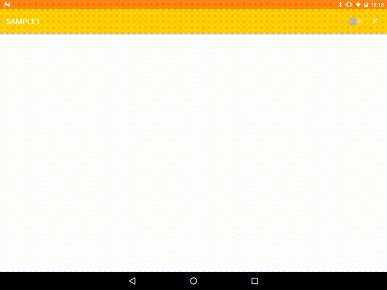

ポインタを識別するには、Indexではなく、IDを利用します。
IDを利用して塗り分けるには以下のように実装します。

```kotlin
private fun drawTouch(canvas: Canvas, event: MotionEvent) {
    for (i in 0 until event.pointerCount) {
        val id = event.getPointerId(i)
        paint.color = COLORS[id % COLORS.size]
        canvas.drawCircle(event.getX(i), event.getY(i), radius, paint)
    }
}
```

実行すると以下のようになり、一つめのポインタが離れたあとも、２つめのポインタの色は変わりません。

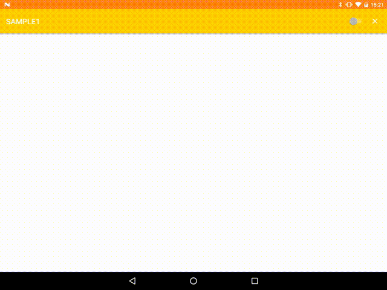

#### タッチイベントの更新頻度

タッチイベントの通知（`View#onTouchEvent()`や`OnTouchListener#onTouch()`コール）は、
タッチセンサーの時間解像度で毎回コールされているわけではなく、ある程度間引いた頻度でコールされます。

実際どの程度の解像度であって、どの程度間引かれるのかは、タッチセンサーの精度と処理能力などによって決まるため、端末ごとに異なります。

MotionEventは通知されたタイミングその時の情報だけでなく、
前回の通知から、今回の通知までの間に発生した情報を保持している場合があります。

履歴の数は

```java
int getHistorySize()
```

で取得できます。

なお、履歴を保持しているのは`ACTION_MOVE`のときのみでそれ以外の場合は`0`が戻ります。`1`ではないので注意してください。
`ACTION_MOVE`のときも`0`で通知される場合もあります。
履歴のなかの最新の座標と、現在の座標は同一ではありません。

UIの操作に利用する場合は、通常最新の情報だけあれば事足りますので、あまり利用するシーンはないかもしれませんが、
ドラッグの軌跡を描画するようなアプリではこの情報を利用しないと、なめらかな軌跡を描くことができません。

履歴を含めて各ポインターの座標を描画させる処理は以下のようにします。

```kotlin
private fun drawTouchWithHistory(canvas: Canvas, event: MotionEvent) {
    val historySize = event.historySize
    for (i in 0 until event.pointerCount) {
        val id = event.getPointerId(i)
        paint.color = COLORS[id % COLORS.size]
        if (historySize == 0) {
            canvas.drawCircle(event.getX(i), event.getY(i), radius, paint)
        } else {
            for (h in 0 until historySize) {
                canvas.drawCircle(event.getHistoricalX(i, h), event.getHistoricalY(i, h), radius, paint)
            }
        }
    }
}
```

Toolbarのスイッチで履歴の有無を切りかえて見せたものが以下です。

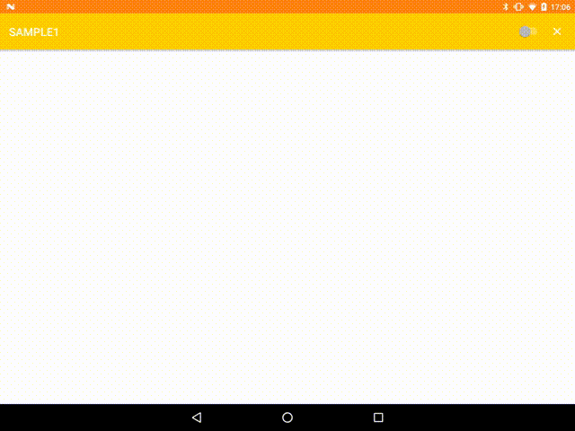

点の密度が明らかに違っていることがわかってもらえると思います。

### イベント種別

MotionEventのイベント種別はActionという値で取得します。
Actionの値は

```java
int getAction()
```

で取得できます。
マルチタッチのハンドリングを行わない場合はこのメソッドでも問題ない場合が多いですが、
マルチタッチに関するActionは発生したポインタの情報とのビット和になっているため、後述のメソッドを利用するほうがよいでしょう。

```java
int getActionMasked()
```

Pointer Index情報を除外したAction情報を取得できます。


```java
int getActionIndex()
```

イベントが発生したPointer Indexを取得できます。

#### ActionMaskedの値

イベントの種別としては他にもありますが、タッチ操作に関しては以下を理解しておけばよいでしょう。

|イベント|意味|
|:-|:-|
|ACTION_DOWN|タッチ開始：指が触れた|
|ACTION_MOVE|移動|
|ACTION_UP|タッチ終了：指が離れた|
|ACTION_CANCEL|タッチ終了：他にイベントが奪われた|
|ACTION_POINTER_DOWN|2点目以降のタッチ開始|
|ACTION_POINTER_UP|2点以上ある状態でのあるポインタのタッチ終了|

タッチイベントを受け取る処理を書いたことがある人でも、
意外とよくわからず使っている人がいるだろうイベントは`ACTION_UP`と`ACTION_CANCEL`でしょう。少し前の私です。

この二つのイベントはともにタッチ操作の終了を意味しています。
`ACTION_UP`は指が離れたことによる終了ですが、
`ACTION_CANCEL`は一連のタッチイベントが他の処理によって消費され場合に通知されるイベントです。
名前の通り、それまでイベントを送っていたところへ、他で処理することになったから忘れてくれ、という意味で送られます。
受け取った場合、それまでの処理をキャンセルする必要があります。

例えば、指を離した時点で判定する操作、例えばタップや、フリックについては
その要件をみたしている状態であっても、そのイベントを発生させないで終了させます。

#### ドラッグできるView

ここで、以下のようにドラッグできるViewを作ることを考えてみます。
指に追従して動き、指を離すと、それまでの移動速度で慣性動作を行い、徐々に減速しながら止まるというものです。

[Sample2](https://github.com/ohmae/DroidKaigi2018Sample/blob/master/app/src/main/java/net/mm2d/droidkaigi2018sample/sample2/)
にコードがあります。

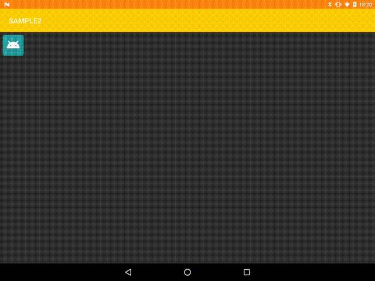

このうち、ドラッグ操作でViewが移動するところだけを抽出すると以下のようになります。

```kotlin
private fun onTouch(view: View, event: MotionEvent): Boolean {
    when (event.actionMasked) {
        MotionEvent.ACTION_MOVE ->
            moveOffset(view, event.rawX - prevX, event.rawY - prevY)
        }
    }
    prevX = event.rawX
    prevY = event.rawY
    return true
}

private fun moveOffset(v: View, dx: Float, dy: Float) {
    v.translationX = v.translationX + dx
    v.translationY = v.translationY + dy
}
```

`ACTION_MOVE`にて、前回通知された座標からの差分を`translationX`/`translationY`に加算することで移動を実現しています。
使用する座標は`getX()`/`getY()`ではうまくいきません。
View自体が移動しているため、相対座標の基準が動いてしまうためです。
このような場合、`getRawX()` / `getRawY()` を使用します。

## ドラッグ速度の計算

前述のドラッグできるViewにて、指を離した後、それまでの移動速度を維持しつつ慣性動作を行っています。
このような動作を実現するためなどに、それまでのタッチの移動速度を求めたい場合は、
[VelocityTracker](https://developer.android.com/reference/android/view/VelocityTracker.html)
を利用するのが簡単です。

速度計算だけを抽出すると以下のような感じで使います。

```kotlin
fun onTouch(view: View, event: MotionEvent): Boolean {
    val tracker = velocityTracker ?: VelocityTracker.obtain()
    velocityTracker = tracker
    tracker.addMovement(event)
    when (event.actionMasked) {
        MotionEvent.ACTION_UP -> {
            tracker.computeCurrentVelocity(FRAME_INTERVAL)
            velocityX = tracker.xVelocity
            velocityY = tracker.yVelocity
            tracker.recycle()
            velocityTracker = null
        }
    }
    return true
}
```

VelocityTrackerはインスタンスを使い回す仕組みがありますので、タッチの開始で `obtain()` でインスタンスを取得し、
タッチの終了で `recycle()` をコールし、インスタンスを解放します。

……ですが、これではうまくいきません。

先に説明したとおり、MotionEventの座標情報はViewの相対座標になっています。
View自体をタッチ座標の変化に合わせて移動させていますので、その座標の変化量を計算しても速度にはなりません。

MotionEventの座標を絶対座標に補正した上で利用する必要があります。

補正の方法としては以下のようにMotionEventのコピーを作成した上で`offsetLocation()`で絶対座標に戻して利用します。
`recycle()`を忘れないようにしましょう。

```kotlin
MotionEvent.obtain(event).let {
    it.offsetLocation(event.rawX - event.x, event.rawY - event.y)
    tracker.addMovement(it)
    it.recycle()
}
```

今回の場合は、VelocityTrackerに渡すところだけ補正すればいいので以下のような方法でもよいでしょう。

```kotlin
val dx = event.rawX - event.x
val dy = event.rawY - event.y
event.offsetLocation(dx, dy)
tracker.addMovement(event)
event.offsetLocation(-dx, -dy)
```

いずれにせよ、MotionEventはこのあとも他のViewなどへ伝搬していくものなので、
座標の変換を行う場合は、影響が出ないようにコピーに対して行うか、利用後他に伝搬させる前に元に戻すかが必要です。

## タップとは何か？

前項で出てきたドラッグできるViewに対して、タップの判定もできるようにしてみましょう。

簡単ですね。OnClickListenerを登録して

```kotlin
icon.setOnClickListener { _ ->
    Toast.makeText(this, "clicked", Toast.LENGTH_SHORT).show()
}
```

クリックの判定は`onTouchEvent()`の中で行われていますので、`super.onTouchEvent()`を呼ぶようにします。
では動かしてみましょう。

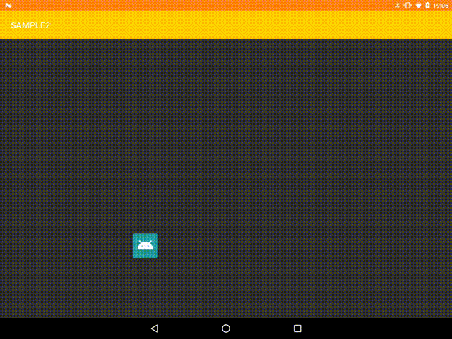

はい、ダメですね。
ドラッグしたのにタップ判定をしてしまっています。

これをうまく判定するためには、そもそもタップとは何か？を理解する必要があります。

### タップとはなんだろう？

タップというものがどういう操作なのかはわかっていても、その厳密な定義は何か？は以外と皆さん知らないものです。

> 指をちょんと触れて離す。
> 一定時間より短くないといけなさそう？
> ドラッグみたいに指が触れている間に移動が発生してはいけない？

なんとなくそんな認識だったりするのではないでしょうか。

正解を言うと、「指が触れてから離れるまでの間に、他のイベントにタッチイベントが消費されなかった」このときタップと判定します。

時間とか、動く距離とかは関係ありません。

例えばAndroidでは500ms以上指を押しつけたままにしておくとLongClickと判定されます。
もちろんLongClickのイベントが消費された場合は、そのあと指が離れてもタップではありません。
ですが、LockClickのイベントが消費されていない場合、OnLongClickListenerが登録されていない場合は、
500ms以上指を押しつけた後指を離してもタップと判定されます。

ドラッグも同様です。ドラッグ操作が判定されて、そこでイベントが消費されない場合は、指を動かした後で指を離してもタップと判定されます。

先ほどの例で言うと、`OnClickListener`を追加し、`onTouchEvnet()`で`super.onTouchEvent()`を呼び出しただけだと、
`super.onTouchEvent()`からみると、指がViewに触れた後、何も起こらず、指が離れただけになりますので、タップと判定されてしまったのです。

さて、今回の例の場合、ドラッグできるViewをタップできるようにしようとしていますので、
指が触れてから離すまでの間、ドラッグが発生しない場合にタップと判定するようにすればよいのです。

ただ、その場合、ドラッグが発生していない状態をどう判定するかという問題が出てきます。

条件を`ACTION_MOVE`が発生しない、などとしてしまうとうまくいきません。
どんな短時間のタップでも`ACTION_MOVE`が発生しない訳ではありません。
端末によっては発生しない場合もあったりするあたりがややこしくしていますが、
通常人間が単にタップしただけの操作でもわずかなポインタの移動は発生しうるものなので、
それを許容するようにしておかないと、タップするのが難しい、とか、端末や人によってタップできないとかいう状態になってしまいます。

こういう操作のスレッショルドの基準となる情報は
[ViewConfiguration](https://developer.android.com/reference/android/view/ViewConfiguration.html)
を利用することで取得できます。

先ほどの例を改善したのが以下のコードです。

```kotlin
private val touchSlopSquare by lazy {
    val touchSlop = ViewConfiguration.get(this).scaledTouchSlop
    touchSlop * touchSlop
}

private fun onTouch(view: View, event: MotionEvent): Boolean {
    when (event.actionMasked) {
        MotionEvent.ACTION_DOWN -> {
            dragging = false
            startX = event.rawX
            startY = event.rawY
        }
        MotionEvent.ACTION_MOVE ->
            if (dragging) {
                moveOffset(view, event.rawX - prevX, event.rawY - prevY)
            } else if (hypotenuseSquare(event.rawX - startX, event.rawY - startY) > touchSlopSquare) {
                dragging = true
            }
        MotionEvent.ACTION_UP -> {
            if (!dragging) {
                Toast.makeText(this, "Tapped", Toast.LENGTH_SHORT).show()
            }
        }
    }
    prevX = event.rawX
    prevY = event.rawY
    return true
}
```

途中利用している`hypotenuseSquare()`は以下のような定義の2値の二乗和を求める独自関数です。

```kotlin
fun hypotenuseSquare(x: Float, y: Float): Float {
    return x * x + y * y
}
```

タッチの開始から移動距離が `scaledTouchSlop` を超えるまではドラッグを発生させないようにしています。
ドラッグが発生する前に `ACTION_UP` に到達した場合にタップと判定します。

さて、これでタップ判定をさせたものが以下になります。

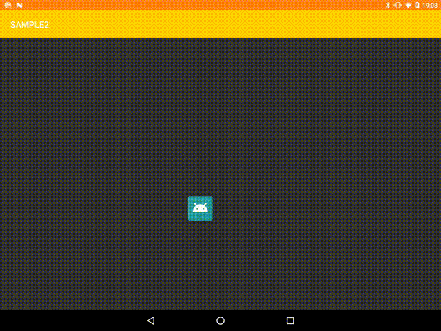

ちゃんと、ドラッグの時には反応しないで、タップに対して反応できています。

ついでに補足しておくと、`OnClickListener`がいけないわけでも、`super.onTouchEvent()`がいけないわけでもなくて、
`onTouchEvnet()`で別のことをやっているのに、同時に`super.onTouchEvent()`を単純にコールしていたことが問題です。
`super.onTouchEvent()`の呼び出し方法を工夫すれば、`OnClickListener`でタップイベントを正しく受け取れるようにも作ることができます。
近いことを後ほどやります。

なお、前述の計算で距離をそのまま計算するのではなく、二乗和と距離の二乗を比較しているのは、
平方根の計算はコストが高いためです。
平方根はとらなくても大小関係は変わりませんからね。

タッチイベントは1秒のうちに何度も呼ばれる処理なので、計算コストを下げる工夫も重要です。

## タッチイベントの伝搬

タッチイベントを受け付けるメソッドには以下のようなものがあります。

- Activity
  - `dispatchTouchEvent()`
  - `onTouchEvent()`
- ViewGroup
  - `dispatchTouchEvent()`
  - `onInterceptTouchEvent()`
  - `onTouchEvent()`
- View
  - `dispatchTouchEvent()`
  - `onTouchEvent()`

`View#OnTouchListener`は？という疑問もあるかもしれませんが、
`OnTouchListener`については、`View#onTouchEvent()`と同じだと思っていただければよいです。
より厳密には`OnTouchListener`が登録されていると`onTouchEvent()`より優先して`OnTouchListener#onTouch()`がコールされますが、
どちらも役割的には同じです。

これらのメソッドの関係は以下のような関係になっています。

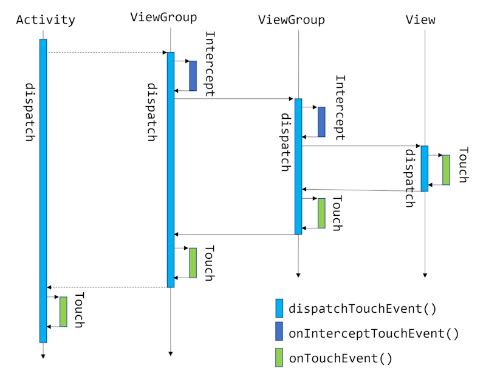

ActivityからViewGroupの間は実装が隠蔽されていますが最終的にはつながっています。

`dispatchTouchEvent()`はここで説明するタッチイベントの伝搬の仕組みをになっているメソッドですので、
Overrideして実装を完全に書き換えるということは通常やらないと思います。

`onTouchEvent()`と`onInterceptTouchEvent()`の使いこなしが重要になってきます。

### onTouchEvent()

`onTouchEvent()`に着目してみますと、タッチイベントは一番上のレイヤーから順次下へイベントが伝搬していく仕組みになっています。

ただし、これはすべてのメソッドがコールされるわけではありません。
`ACTION_DOWN`のイベントにおいて、`true`を返すメソッドまでがコールされます。
`true`を返した階層以下の`onTouchEvent()`はコールされません。
それ以降のイベント（`ACTION_UP` or `ACTION_CANCEL`まで）では`ACTION_DOWN`で`true`を返した階層の`onTouchEvent()`だけがコールされるようになります。
`ACTION_DOWN`以外のイベントでは`true`を返しても`false`を返しても変わりありません。

`ACTION_DOWN`で`true`を返すか`false`を返すかが重要です。
仮に`ACTION_UP`だけを受け取りたいという場合であっても`ACTION_DOWN`で`true`を返しておく必要があります。

### onInterceptTouchEvent()

次は、`onInterceptTouchEvent()`に着目してみます。
これは、子Viewを持ちうるViewGroupのサブクラスにしかないメソッドです。
`onTouchEvent()`とは逆に、下位レイヤーから順にコールされていきます。
コールされる条件は、その階層より上位レイヤーの`onTouchEvent()`がコールされる場合となります。
ただし、`ACTION_DOWN`の場合は子Viewが存在しない場合でもコールされます。

このメソッドはその名の通り、子Viewに伝搬されていくタッチイベントを途中で奪い取るために使います。

`false`を返すと何も発生しませんが、`true`を返した時点で子Viewへ受け渡されるタッチイベントを
自分の`onTouchEvent()`へ流し始めることができます。

その処理は、一連のイベントの「途中」か否かで変わってきます。
すなわち、`ACTION_DOWN`の時とそれ以外で違います。

`ACTION_DOWN`の場合：
- 子Viewの`dispatchTouchEvent()`はコールされず、自身の`onTouchEvent()`がコールされます。

`ACTION_DOWN`以外の場合：
- 子Viewへは`ACTION_CANCEL`が伝えられます。また、このイベントでは自身の`onTouchEvent()`がコールされません。

`true`を返した次のイベントからは、そのViewの`onInterceptTouchEvent()`はコールされず、子Viewの`dispatchTouchEvent()`もコールされません。
そのViewの`onTouchEvent()`がコールされるようになります。

`ACTION_DOWN`については`onInterceptTouchEvent()`/`onTouchEvent()`両方で受け取る可能性があります。
（`onInterceptTouchEvent()`がtrueを返した場合、子Viewが`onTouchEvent()`で`false`を返した場合）

逆に、`ACTION_DOWN`以外でタッチイベントを奪った場合、
`onTouchEvent()`は`ACTION_DOWN`なしで、途中からタッチイベントをうけとることになります。
`onInterceptTouchEvent()`でやるべき処理と、`onTouchEvent()`でやるべき処理は、一部オーバーラップするため、よく考える必要があります。

また、先に説明した`ACTION_CANCEL`が伝えられるシーンも出てきました。
このように、`ACTION_DOWN`が渡され、始めてしまった処理をキャンセルしなければならない場合に送られるActionなのです。

### 問題：ここだけ触れるようにして

[Sample3](https://github.com/ohmae/DroidKaigi2018Sample/blob/master/app/src/main/java/net/mm2d/droidkaigi2018sample/sample3/)

下の画面を見てください。
新機能の紹介でよく使われる表現ですね。

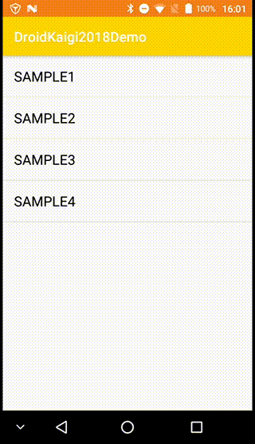

この画面の青い円の真ん中に開いた穴の中、
つまり訴求しているボタンのみをそのまま押せるようにして、
他の部分は触っても下のボタンが反応しないようにしたい。
ということはよくあると思います。

これまでの経緯を踏まえるとどうすればいいかすぐにわかると思います。

オーバーレイ表示しているViewで以下のようにします。

```kotlin
override fun onTouchEvent(event: MotionEvent): Boolean {
    val dx = event.x - centerX
    val dy = event.y - centerY
    return hypotenuseSquare(dx, dy) >= holeRadiusSquare
}
```

こんな感じで、タップされた座標が穴の中なら`false`を返し、外なら`true`を返すようにします。
穴の中を触った場合だけ、その下位レイヤーのViewへタッチイベントが伝搬しますので、タップに反応するようになります。
穴の外を触った場合は、このオーバーレイ表示Viewでイベントを消費してしまうため、下位レイヤーのViewは反応しません。

### 問題：ドラッグ操作を受け取り、子Viewの位置を動かすViewGroup、子Viewは`OnClickListener`を登録可能

[Sample4](https://github.com/ohmae/DroidKaigi2018Sample/blob/master/app/src/main/java/net/mm2d/droidkaigi2018sample/sample4/)

ちょっとややこしいですが、以下の画面のようなものを考えます。

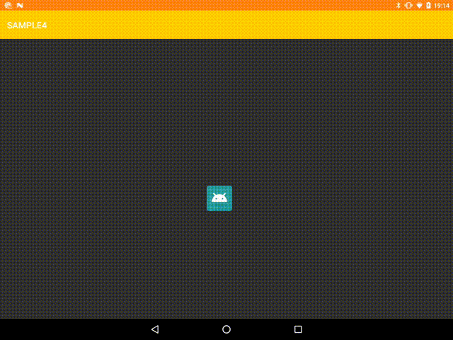

Sample2と似ていますが、ドラッグを実現するためにタッチイベントをハンドリングしているのは
アイコンの方ではなく、それを内包しているViewGroupです。
なので、アイコンの外をドラッグしてもアイコンが動きます。

そして、アイコンのタップ判定も行います。
これはアイコンへ`OnClickListener`を登録することで実現します。

Sample2では元々動かされるView自身の`onTouchEvent()`をOverrideしていたので、その中でタップ判定をしてもよかったのですが、
タッチを受け取って子Viewを動かせるような汎用的なViewGroupを考えた場合、
そのViewGroupが提供する操作以外については子View側にやってもらう、
しかも通常のViewGroupに配置したのと同様に`OnTouchListenre`などが使えるようにするのがよいでしょう。

その実現方法について考えてみます。

- タッチのイベントをすべてViewGroupで受け取るようにしてしまうと、
子Viewへタッチイベントが送られなくなってしまう。
つまり、少なくともドラッグと判定するまでのイベントについては子Viewへ渡す必要があります。
- 子Viewはタッチイベントを消費するかどうかわかりません、
  - 消費された場合は、ViewGroupの`onTouchEvent()`はコールされません。
  ドラッグ状態かどうかの判定は`onInterceptTouchEvent()`で行わなければなりません。
  - 消費しない場合は、ViewGroupの`onTouchEvent()`がコールされます。
  しかし、ドラッグ状態でない場合も、ここで`true`を返しておかないとイベントを受け取れなくなり、ドラッグの判定ができなくなります。
  しかも、`true`を返してしまうと今度は自身の`onInterceptTouchEvent()`がコールされなくなります。

以上のようなことを考えて以下のようにします。

`onInterceptTouchEvent()`ではドラッグ状態になったかどうかを判定し、ドラッグ状態になった場合に`true`を返すようにします。
`true`を返すと、子Viewに`OnClickListener`が登録されていた場合、`ACTION_CANCEL`が渡されるため、タップは判定されなくなります。
`true`を返した後は`onInterceptTouchEvent()`はコールされなくなるのでその後について考える必要はありません。

```kotlin
override fun onInterceptTouchEvent(event: MotionEvent): Boolean {
    when (event.actionMasked) {
        MotionEvent.ACTION_DOWN -> {
            dragging = false
            startX = event.rawX
            startY = event.rawY
        }
        MotionEvent.ACTION_MOVE ->
            if (hypotenuseSquare(event.rawX - startX, event.rawY - startY) > touchSlopSquare) {
                dragging = true
            }
    }
    prevX = event.rawX
    prevY = event.rawY
    return dragging
}
```

`onTouchEvent()`ではドラッグ状態になる前にコールされる可能性もあるので、
`onInterceptTouchEvent()`で行っている、ドラッグ状態かどうかの判定をこちらでも行う必要があります。
ただし、`ACTION_DOWN`については`onInterceptTouchEvent()`側が必ずコールされますので、
処理を変更する必要がないのであれば拾う必要はありません。
ここまで来た場合は必ずイベントを受け取るようにする必要がありますので、戻り値は`true`にします。

```kotlin
override fun onTouchEvent(event: MotionEvent): Boolean {
    when (event.actionMasked) {
        MotionEvent.ACTION_MOVE -> {
            if (dragging) {
                moveOffset(event.rawX - prevX, event.rawY - prevY)
            } else if (hypotenuseSquare(event.rawX - startX, event.rawY - startY) > touchSlopSquare) {
                dragging = true
            }
        }
    }
    prevX = event.rawX
    prevY = event.rawY
    return true
}
```

## ピンチとは何か？

[Sample5](https://github.com/ohmae/DroidKaigi2018Sample/blob/master/app/src/main/java/net/mm2d/droidkaigi2018sample/sample5/)

以下のような、ドラッグでき、ピンチ操作で縦横方向を独立して拡大縮小できるグリッドを考えます。


広大なマップの一部を拡大して見せる窓をイメージしていただければいいと思います。
これの表示パラメータは窓の左上の座標(x, y)と、一つのマス目の縦横の大きさ(scaleX, scaleY)の4つで
す。
この辺は計算しやすいパラメータを定義すればよいので重要ではないのですが、以下の説明ででてきますので一応おいておきます。

### ピンチによるスケール操作

ピンチによるスケール操作を行いたい場合、
[ScaleGestureDetector](https://developer.android.com/reference/android/view/ScaleGestureDetector.html)
というクラスを使うのが便利です。

スケール操作を行うと
[OnScaleGestureListener](https://developer.android.com/reference/android/view/ScaleGestureDetector.OnScaleGestureListener.html)
に通知が来ます。リスナーの引数に`ScaleGestureDetector`のインスタンスが含まれていますので、
`ScaleGestureDetector`からスケールに関するパラメータを読み出して処理を行います。

```java
float getScaleFactor()
```

これは拡大率の変化を受け取ります。
縦横の拡大率を同一にしている場合はこちらを利用すればよいでしょう。
しかし、今回の例では縦横の拡大率を独立して設定できるようにしていますので

```java
float getCurrentSpanX()
float getCurrentSpanY()
float getPreviousSpanX()
float getPreviousSpanY()
```

を利用して、縦横の拡大率の変化を計算します。

`ScaleGestureDetector`ではこんな感じで、縦横の拡大率の変化を計算して

```kotlin
val scaleDetector = ScaleGestureDetector(this, object : SimpleOnScaleGestureListener() {
    override fun onScale(detector: ScaleGestureDetector): Boolean {
        val scaleFactorX = detector.currentSpanX / detector.previousSpanX
        val scaleFactorY = detector.currentSpanY / detector.previousSpanY
        gridMap.gridMapContext.onScaleControl(scaleFactorX, scaleFactorY)
        gridMap.invalidate()
        return true
    }
})
```

以下のようにパラメータに反映させます。

```kotlin
internal fun onScaleControl(scaleFactorX: Float, scaleFactorY: Float) {
    scaleX = clamp(scaleX * scaleFactorX, scaleXMin, scaleXMax)
    scaleY = clamp(scaleY * scaleFactorY, scaleYMin, scaleYMax)
    ensureGridRange()
}
```

これで動かしてみましょう。

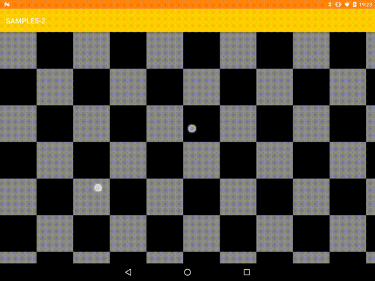

ちょっと思ったのと違いますね。

#### スケール操作の中心を考慮

通常ピンチ操作を行った場合は、指を広げたその中心から広がるような動作を期待すると思います。

操作の中心は`ScaleGestureDetector`から取得することができます。

```java
float getFocusX()
float getFocusY()
```

ではこのパラメータを利用してこんな風に拡大率を反映させてみましょう

```kotlin
val scaleDetector = ScaleGestureDetector(this, object : SimpleOnScaleGestureListener() {
    override fun onScale(detector: ScaleGestureDetector): Boolean {
        val scaleFactorX = detector.currentSpanX / detector.previousSpanX
        val scaleFactorY = detector.currentSpanY / detector.previousSpanY
        gridMap.gridMapContext.onScaleControl(detector.focusX, detector.focusY, scaleFactorX, scaleFactorY)
        gridMap.invalidate()
        return true
    }
})
```

拡大率の変化にともなって発生する操作の中心座標の移動量を計算し、その分逆方向に移動させることで
操作の中心が移動せず、そこを中心に拡大縮小が行われているように見せることができます。

```kotlin
internal fun onScaleControl(focusX: Float, focusY: Float, scaleFactorX: Float, scaleFactorY: Float) {
    val newScaleX = clamp(scaleX * scaleFactorX, scaleXMin, scaleXMax)
    val newScaleY = clamp(scaleY * scaleFactorY, scaleYMin, scaleYMax)
    x -= focusX / newScaleX - focusX / scaleX
    y -= focusY / newScaleY - focusY / scaleY
    scaleX = newScaleX
    scaleY = newScaleY
    ensureGridRange()
}
```

さて、動きを見てみましょう。

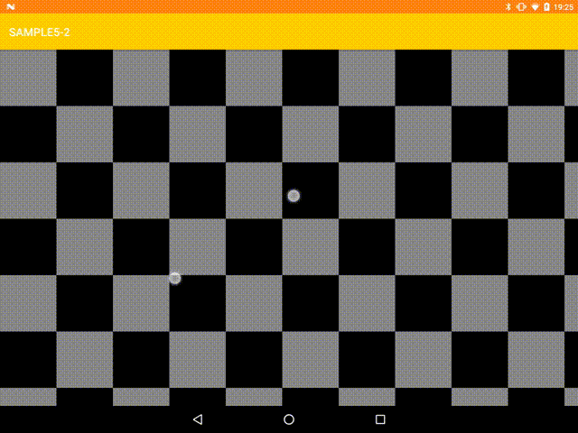

なかなかいい感じですね。

では、ちょっと意地悪をして、片方の点を動かさず、もう一つの点の移動のみのピンチ操作を行ってみましょう。

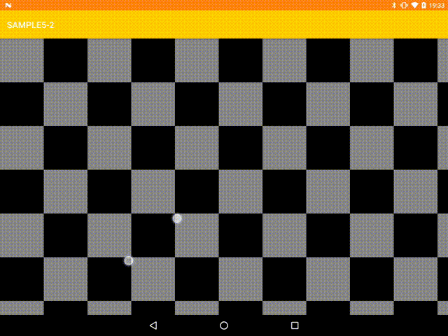

ちょっとまだ違和感がありますよね。
理想としては、押さえている点はグリッドに対して動かない、
各ポインタのグリッドに対する相対位置が固定されたような動きになってほしいところです。

上の例では少し極端ではありますが、通常のピンチ操作でも、
例えば、人差し指と親指でのピンチを行った場合、通常、人差し指の方の移動量の方が多いはずです。
この、ピンチ操作の各点の移動量が均一ではないということへの配慮が必要となります。

では、どうすればいいかですが、ピンチによる移動成分を考慮します。
すこしわかりにくいかもしれませんが、以下のように2点の移動量が違っていると、中心座標が移動しています。

```
  ○--●--○
○--------●--------○
```

中心座標が移動は全ポインタのが平均としての移動量ですので、
ピンチという操作がないものと考えれば複数の点をタッチしているものの全体としてそちら方向に移動している。
つまり、複数本の指を使ったドラッグに相当する操作をしているのと同義です。

この中心座標の移動分、グリッドも移動させてやる必要があります。

さて、それを実現する場合、`ScaleGestureDetector`では少し機能不足です。
現在の中心座標を受け取ることは可能ですが、以前の中心座標の情報はありません。
また、移動を通知するものではないため、スケール操作以外の通知を受け取ることができません。

方法としては

+ [GestureDetector](https://developer.android.com/reference/android/view/GestureDetector.html)を利用し、`onScroll()`で移動を行う。
+ 拙作[MultiTouchGestureDetector](https://github.com/ohmae/DroidKaigi2018Sample/blob/master/app/src/main/java/net/mm2d/droidkaigi2018sample/sample5/MultiTouchGestureDetector.kt)を利用する。

どちらでも同じですが、`MultiTouchGestureDetector`は今回の操作に特化して作成したことと、
実装を読みやすく作ったので具体的な処理を紹介します。

やっていることは簡単なベクトル計算です。

はじめに全ポインタの中心座標を求めます。

次に、その中心座標から全座標へのX座標、Y座標それぞれの距離の平均を求めます。
この距離の変化が拡大率の変化となります。

計算できたら、中心座標の移動と拡大率の変化を通知します。

```kotlin
private fun handleMotionEvent(event: MotionEvent, notify: Boolean, excludeActionPointer: Boolean = false) {
    val count = event.pointerCount
    val skipIndex = if (excludeActionPointer) event.actionIndex else -1
    val div = if (excludeActionPointer) count - 1 else count

    // ポインタの中心座標を求める
    var sumX = 0f
    var sumY = 0f
    for (i in 0 until count) {
        if (i == skipIndex) continue
        sumX += event.getX(i)
        sumY += event.getY(i)
    }
    val focusX = sumX / div
    val focusY = sumY / div

    // 中心座標から各ポインタへの距離の平均をピンチ操作の基準値とする
    var devSumX = 0f
    var devSumY = 0f
    for (i in 0 until count) {
        if (i == skipIndex) continue
        devSumX += Math.abs(focusX - event.getX(i)) / div
        devSumY += Math.abs(focusY - event.getY(i)) / div
    }
    val spanX = devSumX / div * 2
    val spanY = devSumY / div * 2

    if (notify) {
        val scaleX = if (prevSpanX < minimumSpan) 1.0f else spanX / prevSpanX
        val scaleY = if (prevSpanY < minimumSpan) 1.0f else spanY / prevSpanY
        val dX = focusX - prevFocusX
        val dY = focusY - prevFocusY
        mListener.onMove(dX, dY)
        if (scaleX != 1.0f || scaleY != 1.0f) {
            mListener.onScale(focusX, focusY, scaleX, scaleY)
        }
    }
    prevSpanX = spanX
    prevSpanY = spanY
    prevFocusX = focusX
    prevFocusY = focusY
}
```

中心座標の移動を含めたバージョンで先ほどと同じような操作をしてみましょう。

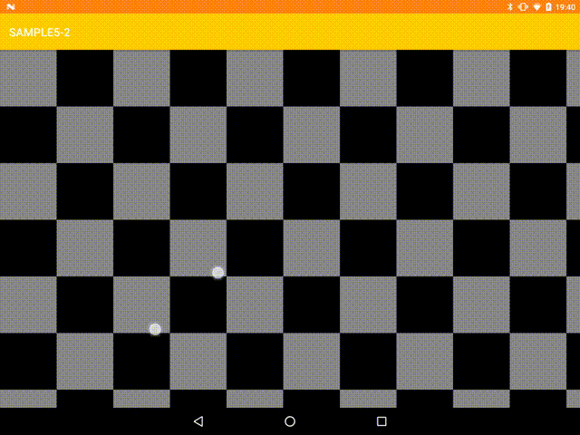

点とグリッドの相対位置が変化しないピンチ操作になっていますね。

ピンチ操作とドラッグを同時に行うと

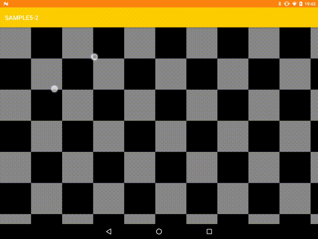

この場合もちゃんとドラッグとピンチ両方が直感に反しない動きになっています。

では、指が2本ではなく3本以上あった場合はどうするか、ですが、
先ほど紹介した処理がすでに、点の数を2個に限定していませんでした。
つまり、同じ処理で指を3本以上使ったピンチ操作を行っても、同様に直感的な動きを見せてくれます。

指3本の場合

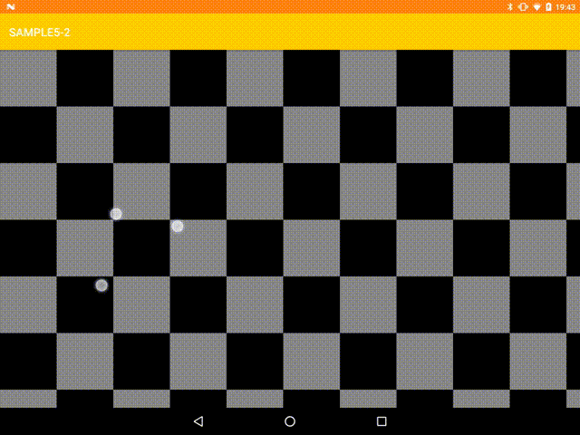

指4本の場合

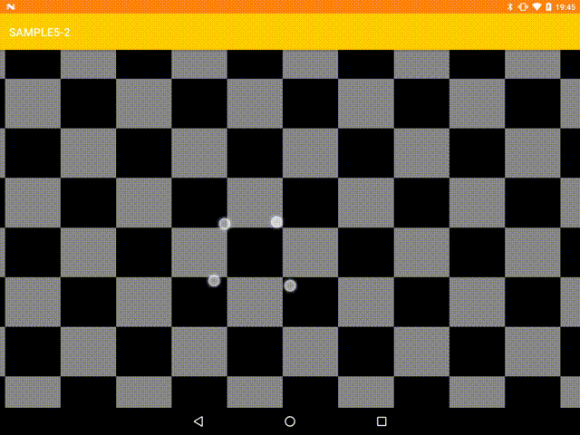

どうでしょう？いい感じに動いてくれるでしょ？

## まとめ

タッチイベントの基本から、実際にユーザの操作を判定する方法を解説してきました。

タッチイベントのハンドリングを注意深く行うことで、複数の動作を違和感なく実現することができます。

しかし、実装コード自体はそれほど長大なものではなかったと思います。ほんの少しの工夫です。

違和感なく操作できるUIはUXを高めてくれます。
工夫して、もっと「気持ちいい」UIを作りましょう！
